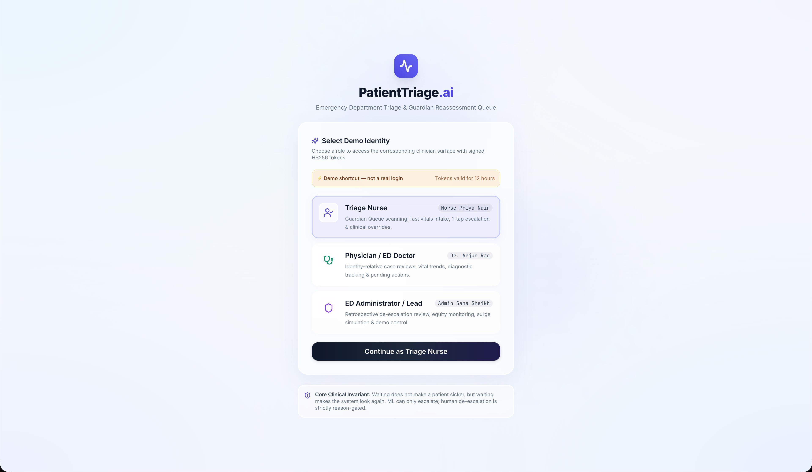
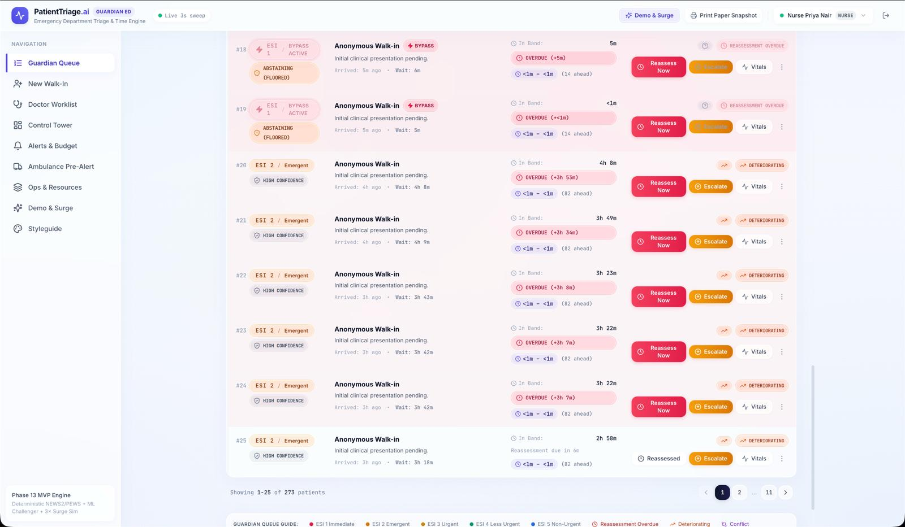
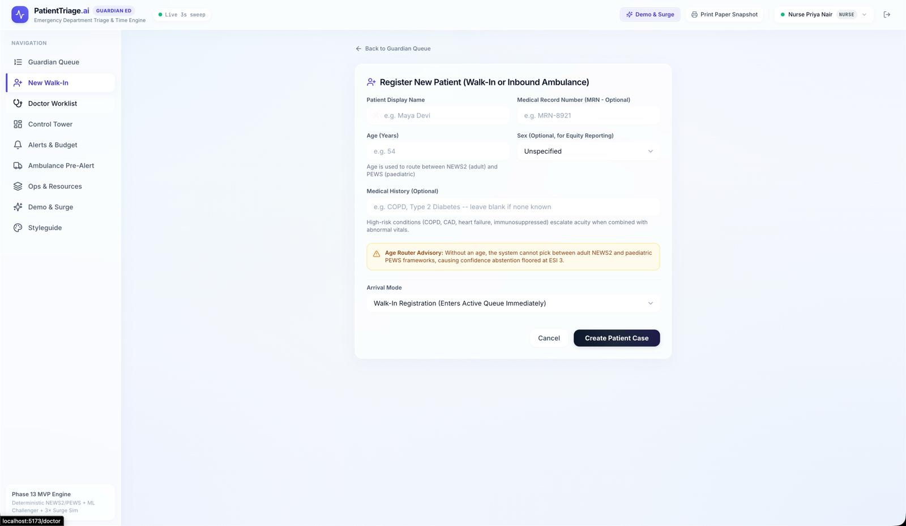
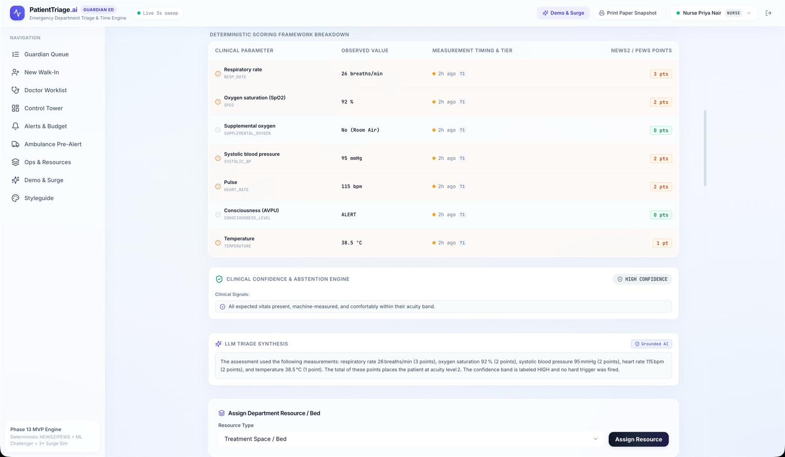
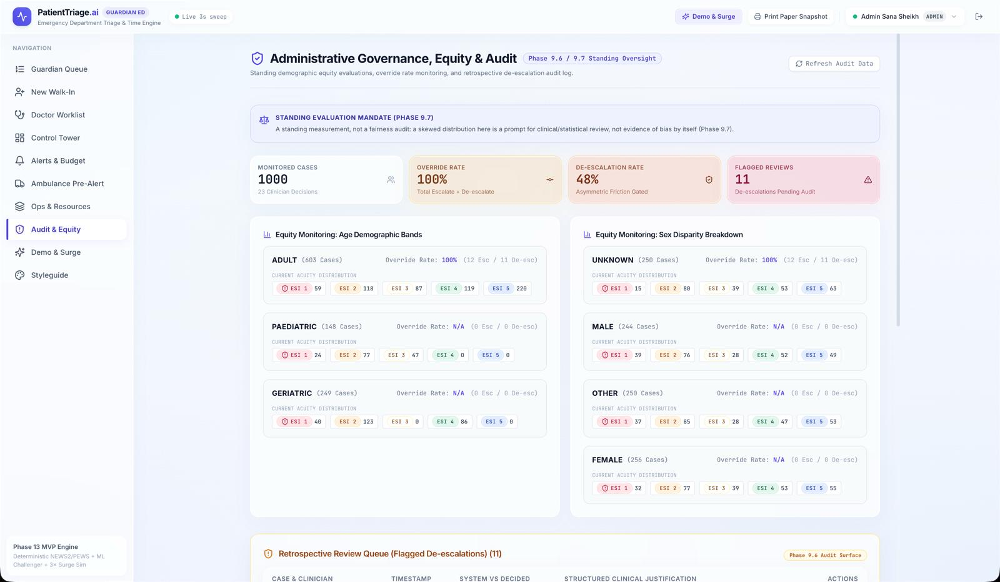
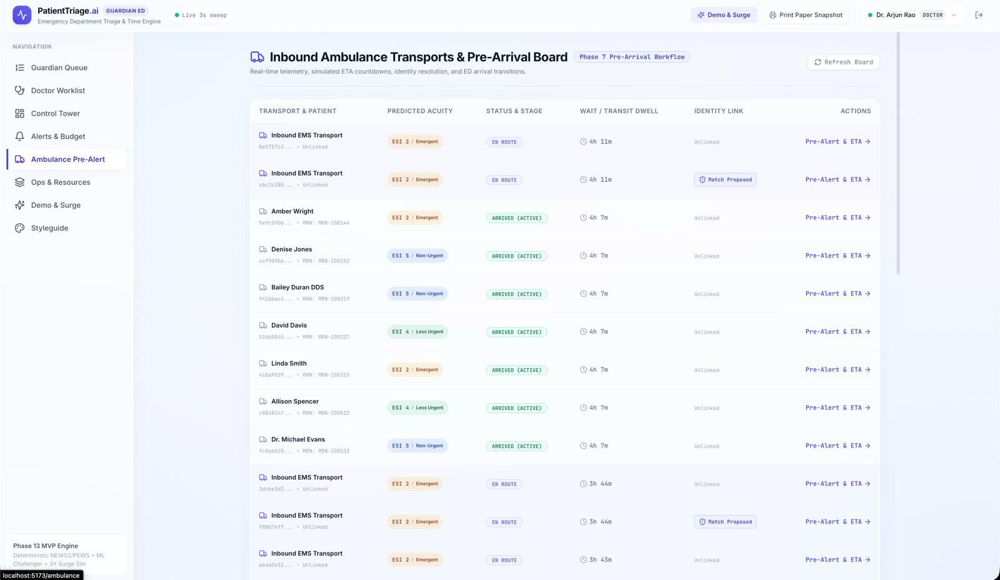
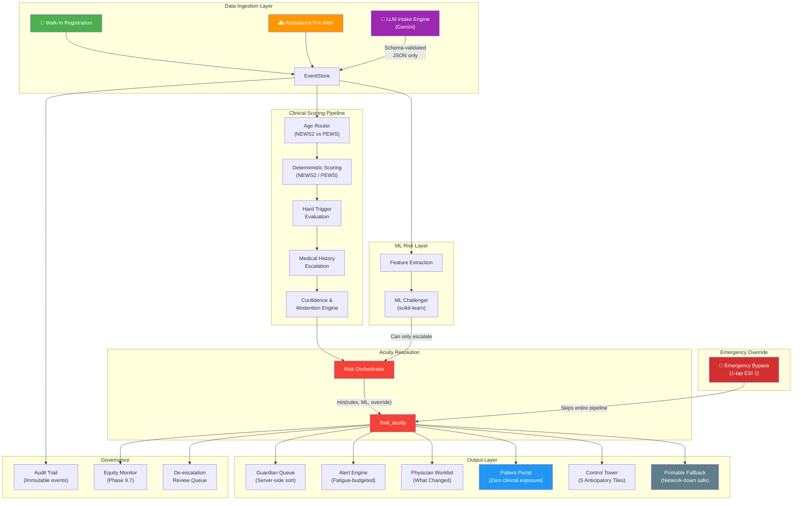

<](https://python.org)
[](https://fastapi.tiangolo.com)
[](https://react.dev)
[](https://typescriptlang.org)
[](https://vitejs.dev)
[](https://scikit-learn.org)
[](LICENSE)
[](#test-suite)

</div>

---

## ⚡ TL;DR

**PatientTriage.ai** is a full-stack clinical decision-support system for hospital Emergency Departments that replaces subjective, error-prone paper triage with a **deterministic scoring engine** (NEWS2 + PEWS), an **ML Risk Challenger** that can only escalate — never downgrade — patient urgency, and an **LLM-powered intake pipeline** that extracts structured vitals from free-text chief complaints. The system enforces a single architectural invariant at every layer:

> **`final_acuity = min(rule_acuity, ml_acuity, override_acuity)`** — whichever system thinks the patient is *sickest* wins. Always.

---

## 🔴 The Problem

| Today's Emergency Department | What Goes Wrong |
|:---|:---|
| **Paper-based triage** with subjective ESI scoring | Inter-rater variability of up to **±2 ESI levels** between nurses |
| No continuous reassessment mechanism | Patients **deteriorate unnoticed** in waiting rooms |
| Alert fatigue from flat notification systems | Clinicians **tune out** 90%+ of electronic alerts |
| No pre-arrival intelligence | Ambulance patients arrive with **zero preparation** |
| Zero transparency for patients/families | Anxiety, frustration, and **complaints to administration** |
| No demographic equity monitoring | Bias in acuity assignment goes **unmeasured and undetected** |

---

## 🟢 The Solution

**PatientTriage.ai** replaces every failure mode above with an engineered, auditable system:

| Capability | Mechanism |
|:---|:---|
| **Deterministic Scoring** | NEWS2 (adults/geriatric) and PEWS (paediatric) with age-aware routing — no guesswork |
| **ML Challenger Guard Rail** | scikit-learn model suggests ESI; system takes `min(rules, ML)` — ML can **only escalate**, never downgrade |
| **LLM Clinical Intake** | Gemini-powered free-text extraction → schema-validated JSON → range-checked observations — LLM output **never reaches the record unchecked** |
| **Guardian Queue** | Server-side priority sort with reassessment countdown timers and deterioration detection |
| **Alert Fatigue Budget** | Per-nurse interruptive alert cap per hour — alerts that exceed budget are batched, never suppressed |
| **Pre-Arrival Board** | Ambulance ETA, predicted acuity, identity matching — care prep begins **before the patient arrives** |
| **Patient Portal** | Transparent wait estimates with **zero clinical data exposure** — no ESI, no scores, no notes |
| **Equity Monitoring** | Standing demographic distribution + override rates by age band and sex — bias is **measured, not assumed** |
| **Printable Fallback** | Plain-text queue snapshot at `/queue/printable` — **survives total frontend/network failure** |

---

## 🖼️ Visual Walkthrough

### Role-Based Access & Demo Identity Selection



> **Role-gated clinical surfaces.** Clinicians select their persona (Nurse, Physician, Administrator) to access the corresponding workspace. Each role issues a signed HS256 JWT token scoped to that persona's permissions. The "Core Clinical Invariant" footer reinforces the system's foundational guarantee: *ML can only escalate; human de-escalation is strictly reason-gated.*

---

### Nurse Guardian Queue — Real-Time Priority Board



> **The operational heart of the ED.** Every patient is ranked by a composite server-side sort key: `final_acuity ASC → time_critical_flag DESC → deterioration_trend DESC → time_in_band DESC → arrival_time ASC`. Queue order is **never computed client-side**. Overdue reassessment timers (red "OVERDUE" badges), deterioration chips, and 1-tap "Reassess Now" / "Escalate" actions give nurses instant decision affordances. The bottom bar confirms **273 tracked patients** across 11 pages — stress-tested at 3x surge load.

---

### Patient Registration — Walk-In & Ambulance Intake



> **Structured intake with clinical guardrails.** The registration form captures demographic data needed for the Age Router (NEWS2 vs PEWS framework selection). The amber "Age Router Advisory" warns that missing age data forces confidence abstention floored at ESI 3 — the system **never defaults to a safe-sounding low acuity; it holds at a conservatively high one**. Arrival mode (Walk-In vs. Inbound Ambulance) determines whether the case enters the active queue immediately or the Pre-Arrival Board.

---

### Deterministic Scoring Framework & LLM Synthesis



> **Full scoring transparency.** Every vital parameter — respiratory rate, SpO2, blood pressure, pulse, consciousness (AVPU), temperature — is displayed with its observed value, measurement tier, and computed NEWS2/PEWS points. The **Clinical Confidence & Abstention Engine** (Phase 9.1/9.2) evaluates data completeness, measurement reliability, scoring boundary proximity, and ML agreement to produce a confidence band (`HIGH` / `MODERATE` / `LOW`). Below, the **LLM Triage Synthesis** provides a grounded natural-language explanation of *why* the system scored this patient at this acuity — tagged with a "Grounded AI" badge confirming the explanation is derived strictly from computed data, not hallucinated.

---

### Administrative Governance, Equity & Audit



> **Standing demographic equity evaluation (Phase 9.7).** The governance dashboard tracks acuity distribution across Adult (603), Paediatric (148), and Geriatric (249) cohorts, plus sex-based breakdowns — surfacing disparity patterns for clinical review, not as automated "fairness corrections." The **Retrospective Review Queue** (Phase 9.6) captures every de-escalation decision with the clinician's identity, structured justification code, and timestamp — making override accountability a first-class system feature, not an afterthought.

---

### Ambulance Inbound Pre-Arrival Board



> **Pre-arrival situational awareness.** Each inbound EMS transport displays predicted acuity, transport stage (`EN ROUTE` → `ARRIVED (ACTIVE)`), dwell time, and identity link status. The **"Match Proposed"** badge indicates the system has found candidate EHR records but will **never silently merge** — identity confirmation requires explicit clinician action via `POST /cases/{id}/identity/confirm`. One-tap "Pre-Alert & ETA →" opens the full pre-arrival workspace with paramedic transport delay simulation.

---

## 🏗️ System Architecture & Pipeline



### Pipeline Step-by-Step

| Step | Component | What Happens |
|:---:|:---|:---|
| **1** | **Data Ingestion** | Patient data enters via walk-in registration, ambulance pre-alert, or LLM-extracted free text. Every mutation is persisted as an immutable event in the EventStore. |
| **2** | **Age Router** | Patient age determines scoring framework: NEWS2 for adults (16+), PEWS for paediatric (<16), with geriatric adjustments (65+). Unknown age → abstention floor at ESI 3. |
| **3** | **Deterministic Scoring** | NEWS2/PEWS computes aggregate scores from 7 vital parameters. Each parameter scored against hospital-configurable range bands. |
| **4** | **Hard Triggers** | Critical single-value triggers (e.g., SpO2 < 85%, respiratory rate > 35) override aggregate scoring and force immediate ESI 1-2 escalation. |
| **5** | **Medical History** | High-risk conditions (COPD, CAD, heart failure, immunosuppression) combined with abnormal vitals escalate acuity by up to 1 ESI level. |
| **6** | **Confidence Engine** | Four-input deterministic evaluation: data completeness, measurement reliability tiers, boundary proximity, and ML agreement → `HIGH` / `MODERATE` / `LOW` band. |
| **7** | **ML Challenger** | scikit-learn model trained on synthetic clinical data produces a probability and suggested ESI. **Can only escalate** — if ML suggests ESI 3 but rules say ESI 2, rules win. |
| **8** | **Risk Orchestrator** | `final_acuity = min(rule_acuity, ml_acuity, override_acuity)` — the single invariant that guarantees zero unsafe under-triage. Persisted as an immutable `RiskAssessment`. |
| **9** | **Output Surfaces** | Guardian Queue, Physician Worklist, Control Tower, Patient Portal, and Printable Fallback all consume the same authoritative `final_acuity`. |

---

## ✨ Key Features

- **🛡️ Architectural Safety Invariant** — `min(rules, ML, override)` means the system *structurally cannot* under-triage. This isn't a policy; it's the code path.
- **⏱️ Time Engine** — Continuous reassessment countdown clocks with overdue detection and automatic priority escalation for patients exceeding their band's reassessment interval.
- **🚨 1-Tap Emergency Bypass** — Clinicians can escalate any patient to ESI 1 (Immediate Resuscitation) with a single tap, bypassing the entire scoring pipeline with zero latency.
- **🤖 LLM-Powered Intake** — Free-text chief complaints are parsed by Gemini into schema-validated, range-checked observations — persisted at the lowest reliability tier (T4) so the Confidence Engine automatically penalizes them.
- **📊 ML Challenger with Refusal Logging** — When ML suggests a lower acuity than rules, the refusal is logged and surfaced in the UI with an explicit callout: *"Rules override ML challenger to prevent unsafe under-triage."*
- **🏥 Configurable Hospital Profiles** — NEWS2/PEWS range bands, acuity thresholds, ML toggle, alert fatigue budgets, and demographic cohort definitions are all loaded from YAML — no code changes for hospital-specific tuning.
- **📋 Degraded-Mode Printable Queue** — A dependency-free plain-text queue snapshot (`GET /queue/printable`) that can be printed directly to paper if the frontend, network, or power fails.
- **🔒 Privacy-First Patient Portal** — Patients see a 4-stage progress tracker and wait estimates. They see **zero** ESI scores, confidence metrics, or clinical notes.
- **⚖️ Standing Equity Evaluations** — Acuity distribution and override rates broken down by age band (Adult/Paediatric/Geriatric) and sex — surfaced for review, not auto-corrected.
- **🚑 Pre-Arrival Intelligence** — Ambulance ETA, predicted acuity, and candidate EHR identity matching — with guaranteed zero silent merges.
- **📝 Immutable Audit Trail** — Every state mutation (observation, scoring, override, bypass, identity link) is an append-only event. De-escalations require structured justification codes.
- **🔊 Alert Fatigue Management** — Per-nurse interruptive alert budget per hour, with Web Audio clinical chimes for critical bypass alerts only.

---

## 🛠️ Tech Stack

| Layer | Technology | Purpose |
|:---|:---|:---|
| **Backend Framework** | FastAPI + Uvicorn | Async REST API with auto-generated OpenAPI docs |
| **Database** | SQLite + SQLAlchemy | Event-sourced patient state store (append-only events) |
| **Clinical Scoring** | Pure Python (NEWS2 / PEWS) | Deterministic, unit-testable scoring functions |
| **ML Model** | scikit-learn + joblib | Risk challenger model with hot-reload capability |
| **LLM Integration** | Google Gemini API | Schema-constrained clinical entity extraction |
| **Privacy** | Custom redaction engine | PII stripping before LLM calls + patient portal isolation |
| **Frontend Framework** | React 18 + TypeScript | Type-safe component architecture |
| **Build Tool** | Vite 5 | Sub-second HMR, optimized production builds |
| **Styling** | Tailwind CSS 3 | Utility-first responsive design |
| **Data Fetching** | TanStack React Query | Cache-managed server state with live polling |
| **Charts** | Recharts | Vital trend sparklines and dashboard visualizations |
| **Forms** | React Hook Form + Zod | Schema-validated clinical input forms |
| **Routing** | React Router 6 | Role-based page navigation |
| **Auth** | PyJWT (HS256) | Role-scoped demo token issuance |
| **Testing (Backend)** | Pytest (39 suites) | Clinical invariant and integration tests |
| **Testing (Frontend)** | Vitest + Testing Library | Component and datetime parsing unit tests |

---

## 🚀 Getting Started

### Prerequisites

- **Python 3.10+** with virtual environment support
- **Node.js 18+** and **npm**
- **Google Gemini API key** (optional — system degrades gracefully without it)

### Installation

```bash
# 1. Clone the repository
git clone https://github.com/your-org/PatientTriage.ai.git
cd PatientTriage.ai

# 2. Set up the Python backend
python -m venv .venv
source .venv/bin/activate        # Windows: .venv\Scripts\Activate.ps1
pip install -r requirements.txt

# 3. Configure environment
cp .env.example .env
# Add your GEMINI_API_KEY to .env (optional — LLM features degrade gracefully)

# 4. Set up the React frontend
cd frontend
npm install
cd ..
```

### Running the Application

Open **two terminal tabs** in the repository root:

#### Terminal 1 — FastAPI Backend (Port 8000)
```bash
source .venv/bin/activate
uvicorn app.main:app --host 127.0.0.1 --port 8000 --reload
```

#### Terminal 2 — Vite Frontend (Port 5173)
```bash
cd frontend
npm run dev -- --host 127.0.0.1 --port 5173
```

### Verify

| Check | URL |
|:---|:---|
| Backend health | http://127.0.0.1:8000/health |
| API docs | http://127.0.0.1:8000/docs |
| Frontend | http://127.0.0.1:5173 |

---

## 📖 Usage

### Seed Demo Data (20 Clinical Scenarios)

```bash
# Via cURL
curl -X POST http://127.0.0.1:8000/demo/seed

# Or via the UI: select "ED Administrator" role → Demo Runner → "Seed 20 Demo Patients"
```

### Register a New Patient

```bash
curl -X POST http://127.0.0.1:8000/cases/ \
  -H "Content-Type: application/json" \
  -d '{
    "display_name": "Arthur Dent",
    "age": 48,
    "chief_complaint": "Chest tightness and severe shortness of breath after climbing stairs",
    "arrival_mode": "WALK_IN"
  }'
```

### Trigger Emergency Bypass

```bash
curl -X POST http://127.0.0.1:8000/cases/{case_id}/bypass
```

### Run Surge Simulation

```bash
curl -X POST http://127.0.0.1:8000/ops/surge
```

### Get Printable Fallback Queue

```bash
curl http://127.0.0.1:8000/queue/printable
```

---

## 🧪 Test Suite

```bash
# Backend — 39 test suites covering clinical invariants
pytest

# Frontend — Unit tests for datetime parsing & API error handling
cd frontend && npm run test

# Frontend — TypeScript type checking
cd frontend && npx tsc --noEmit
```

**Test coverage areas:** Age routing · NEWS2/PEWS scoring · Hard triggers · Emergency bypass · ML challenger refusal · Confidence engine · Conflict detection · Guardian queue ordering · Alert fatigue budgets · Surge simulation · Event store integrity · Privacy redaction · JWT authentication · Wait time estimation · Patient worsening detection

---

## 🗂️ Repository Structure

```
PatientTriage.ai/
├── app/                           # FastAPI backend application
│   ├── main.py                    # Application entrypoint & error handlers
│   ├── db.py                      # SQLAlchemy database initialization
│   ├── timeutil.py                # UTC datetime utilities
│   ├── api/                       # REST API route handlers
│   │   ├── alerts.py              # GET /alerts — fatigue-budgeted alert feed
│   │   ├── audit.py               # GET /audit — de-escalation review log
│   │   ├── auth.py                # POST /auth — JWT token issuance
│   │   ├── cases.py               # CRUD /cases — patient case lifecycle
│   │   ├── conflicts.py           # GET /conflicts — data conflict surface
│   │   ├── control_tower.py       # GET /control-tower — 5 anticipatory tiles
│   │   ├── demo.py                # POST /demo — seed & scenario runner
│   │   ├── diagnostics.py         # Diagnostic sign-off endpoints
│   │   ├── observations.py        # POST /observations — vital submissions
│   │   ├── ops.py                 # POST /ops — surge simulation
│   │   ├── queue.py               # GET /queue — Guardian Queue + printable
│   │   └── resources.py           # Resource/bed assignment with 409 conflicts
│   ├── scoring/                   # Deterministic clinical scoring engine
│   │   ├── engine.py              # Orchestration: Age Router → Score → Triggers
│   │   ├── news2.py               # NEWS2 (adult) scoring framework
│   │   ├── pews.py                # PEWS (paediatric) scoring framework
│   │   ├── age_router.py          # Age-based framework selection
│   │   ├── hard_triggers.py       # Critical single-value override triggers
│   │   ├── medical_history.py     # Comorbidity-based acuity escalation
│   │   ├── confidence.py          # Confidence & Abstention Engine (9.1/9.2)
│   │   ├── risk_orchestrator.py   # min(rules, ML, override) invariant
│   │   ├── conflict_detection.py  # Contradictory-information detection (9.3)
│   │   ├── banding.py             # Score → ESI band mapping
│   │   └── concepts.py            # Clinical concept vocabulary
│   ├── ml/                        # Machine Learning risk challenger
│   │   ├── challenger.py          # Runtime ML prediction (can only escalate)
│   │   ├── features.py            # Feature vector extraction
│   │   ├── train.py               # Model training pipeline
│   │   ├── synthetic_data.py      # Synthetic clinical data generation
│   │   └── artifacts/             # Serialized model + metadata
│   ├── llm/                       # LLM-powered clinical intake
│   │   ├── intake.py              # Free-text → structured observations
│   │   ├── explanation.py         # Grounded triage explanation generation
│   │   └── client.py              # Gemini API client with graceful fallback
│   ├── store/                     # Event-sourced patient state store
│   │   └── event_store.py         # Append-only event log (76KB — core state machine)
│   ├── queue/                     # Guardian Queue engine
│   │   ├── guardian_queue.py      # Priority computation & server-side sort
│   │   ├── time_engine.py         # Reassessment countdown & overdue detection
│   │   ├── printable.py           # Degraded-mode plain-text queue
│   │   └── models.py              # Queue item data models
│   ├── alerts/                    # Clinical alert system
│   │   ├── engine.py              # Alert generation & fatigue budgeting
│   │   └── budget.py              # Per-nurse alert cap enforcement
│   ├── bypass/                    # Emergency bypass mechanism
│   │   ├── engine.py              # 1-tap ESI 1 bypass (skips scoring)
│   │   └── text_patterns.py       # Free-text emergency pattern detection
│   ├── privacy/                   # Privacy & data protection
│   │   ├── redaction.py           # PII redaction before LLM calls
│   │   ├── llm_gateway.py         # Sanitized LLM request proxy
│   │   └── snapshot.py            # Patient portal data isolation
│   ├── ambulance/                 # Pre-arrival workflow
│   ├── audit/                     # De-escalation audit trail
│   ├── auth/                      # JWT authentication
│   ├── config/                    # Hospital profile configuration
│   │   ├── hospital_profile.py    # Profile loader & schema
│   │   └── hospital_profiles/     # YAML hospital configurations
│   ├── dashboard/                 # Control Tower data aggregation
│   ├── demo/                      # Demo scenario runner
│   ├── models/                    # SQLAlchemy ORM models
│   ├── schemas/                   # Pydantic request/response schemas
│   └── ops/                       # Operational tooling (surge sim)
├── frontend/                      # React + TypeScript + Vite frontend
│   ├── src/
│   │   ├── App.tsx                # Root component with React Router
│   │   ├── main.tsx               # Application bootstrap
│   │   ├── api/                   # API client layer (TanStack Query)
│   │   ├── components/            # Reusable UI components
│   │   │   ├── layout/            # Header, sidebar, page shells
│   │   │   └── ui/                # Button, Modal, Select, Badge, etc.
│   │   ├── features/              # Feature-specific components
│   │   ├── pages/                 # Route-level page components
│   │   ├── contexts/              # React context providers
│   │   ├── hooks/                 # Custom React hooks
│   │   ├── lib/                   # Utility functions
│   │   └── types/                 # TypeScript type definitions
│   ├── index.html                 # HTML entry point
│   ├── tailwind.config.js         # Tailwind CSS configuration
│   ├── vite.config.ts             # Vite build configuration
│   └── tsconfig.json              # TypeScript configuration
├── tests/                         # Backend test suites (39 files)
│   ├── conftest.py                # Shared fixtures & test database setup
│   ├── test_scoring_engine.py     # NEWS2/PEWS scoring tests
│   ├── test_emergency_bypass.py   # Bypass invariant tests
│   ├── test_ml_challenger.py      # ML refusal guard tests
│   ├── test_confidence.py         # Confidence band tests
│   ├── test_guardian_queue.py     # Queue ordering invariant tests
│   ├── test_alert_engine.py       # Alert fatigue budget tests
│   ├── test_privacy_redaction.py  # PII redaction tests
│   ├── test_surge_simulator.py    # 3x surge stability tests
│   └── ...                        # 30 additional test suites
├── scripts/                       # Data generation & utilities
│   ├── generate_patients.py       # Synthetic patient data generator
│   └── seed_data/                 # Pre-built demo datasets
├── pictures/                      # Visual assets for documentation
│   ├── 01_role_selection.jpeg     # Role-based access screen
│   ├── 02_guardian_queue.jpeg     # Nurse Guardian Queue
│   ├── 03_patient_registration.jpeg # Walk-in registration form
│   ├── 04_clinical_scoring.jpeg   # Scoring breakdown & LLM synthesis
│   ├── 05_audit_equity.jpeg       # Governance & equity dashboard
│   └── 06_ambulance_board.jpeg    # Ambulance pre-arrival board
├── requirements.txt               # Python dependencies
├── .env.example                   # Environment variable template
├── .gitignore                     # Git ignore rules
└── RUNBOOK.md                     # Operational demo guide (7-minute script)
```

---

## 🗺️ Future Roadmap

| Phase | Capability | Description |
|:---:|:---|:---|
| **v1.1** | **FHIR Integration** | Bidirectional HL7 FHIR R4 interface for EHR interoperability (Epic, Cerner, MEDITECH) |
| **v1.2** | **Real-time Vitals Streaming** | WebSocket ingestion from bedside monitors (Philips, GE) replacing manual entry |
| **v1.3** | **Multi-Hospital Federation** | Cross-facility load balancing and diversion recommendations during regional surges |
| **v2.0** | **Deep Learning Challenger** | Replace scikit-learn with a temporal CNN/Transformer trained on real de-identified ED data |
| **v2.1** | **Sepsis Early Warning** | qSOFA + SIRS + lactate trend detection integrated into the scoring pipeline |
| **v2.2** | **Natural Language Handoffs** | LLM-generated structured handoff notes at shift change, grounded in event history |
| **v3.0** | **Regulatory Certification** | FDA 510(k) / CE MDR Class IIa pathway for clinical decision support software |

---

<div align="center">

**Built with urgency. Engineered for safety. Designed for the clinicians who don't have a second to waste.**

*PatientTriage.ai — Because the sickest patient should always be seen first.*

</div>
]]>
